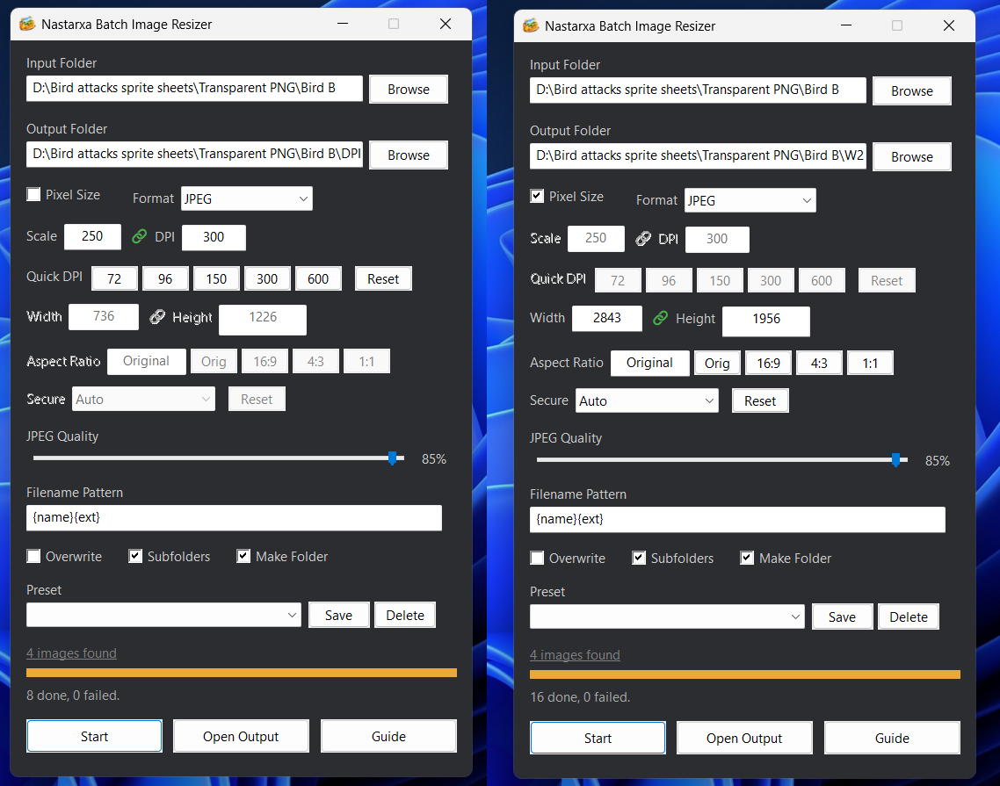

# 🍍 Nastarxa Batch Image Resizer

> 🖼️ Fast batch image resizing tool for Windows.

Resize and export large image collections quickly using built-in Windows technologies with no external dependencies.

No external tools required — everything runs using built-in Windows `System.Drawing`.


---

## 🖼 Image Preview



---

## ✨ Features

### 🖼 Batch Processing
- Resize multiple images at once using percentage scaling or fixed pixel dimensions
- Supports large folders and recursive subfolders
- Parallel processing for faster conversion

### 📏 DPI & Pixel Size Modes

**DPI Mode** (default): resize by percentage scale and set output DPI.
- Set Scale % and target DPI
- Quick DPI presets: 72 / 96 / 150 / 300 / 600
- Lock icon keeps the scale/DPI ratio consistent

**Pixel Size Mode**: resize all images to fixed pixel dimensions.
- Check **Pixel Size** to switch modes
- Enter target **Width** and **Height** in pixels
- Lock icon (🔗) keeps width/height ratio consistent
- **Secure** dropdown controls which dimension is locked:
  - **Auto** — both editable (lock toggles freely)
  - **Secure Height** — Height is auto-calculated from Width + Aspect Ratio
  - **Secure Width** — Width is auto-calculated from Height + Aspect Ratio
- **Aspect Ratio** field forces a custom W:H ratio (e.g., 16:9, 4:3, 1:1)
  - Shows **"Original"** when using each image's native aspect ratio
- Output folder auto-names as `W{width}_H{height}` when "Make Folder" is checked

### 🎨 Format Support
Convert images to:
- PNG
- JPEG
- BMP
- TIFF
- Or keep original format

### 🧩 JPEG Quality Control
- Adjustable quality slider (1–100)
- Uses proper `.NET EncoderParameter` handling

### 🏷 Filename Pattern System
Rename exported files using tokens:

| Token | Description |
|---|---|
| `{name}` | Original filename |
| `{ext}` | Output extension |
| `{counter}` | Sequential number |

Examples:

```txt
{name}_resized{ext}
thumb_{name}{ext}
img_{counter}{ext}
```

### 💾 Presets (DPI Mode only)
Save and reuse your favorite DPI mode settings:
- Thumbnail
- Web Standard
- Print High
- Anime Keyframe
- Custom presets

### 🖱 Quality of Life
- Drag & drop folder support
- File count preview (click to view full file list)
- Flat dark progress bar
- Session auto-save
- Failed file reporting
- Resizable interface
- Built-in **Guide** window

---

## 📦 Requirements

- Windows 7 or newer
- AutoHotkey v2
- PowerShell (already included in Windows)

---

## 🚀 Usage

1. Launch:

```txt
Nastarxa Batch Image Resizer.ahk
```

2. Select:
   - Input folder
   - Output folder

3. Configure:
   - **DPI Mode**: Scale % + DPI (default)
   - **Pixel Size Mode**: check "Pixel Size" for fixed-size resizing
   - **Secure Mode**: choose Auto / Secure Height / Secure Width
   - Output format
   - JPEG quality

4. Click **Start** (or **Guide** for help)

Processed images will appear in the output folder.

---

## 📁 File Structure

| File | Description |
|---|---|
| `Nastarxa Batch Image Resizer.ahk` | Main GUI application |
| `Nastarxa Batch Image Resizer.ps1` | Image processor using System.Drawing |
| `Nastarxa Batch Image Resizer Presets.ini` | Saved presets |
| `Nastarxa Batch Image Resizer Settings.ini` | Session settings |
| `Resizer.ico` | Application icon |

---

## ⚙ How It Works

The AutoHotkey script handles:
- GUI
- File management
- Parallel task execution
- Session saving

Each image is processed through PowerShell using built-in `.NET System.Drawing`:

- Loads source image
- Resizes with `HighQualityBicubic`
- Applies target DPI
- Exports using selected encoder
- JPEG exports use proper quality encoding

No ImageMagick.  
No external libraries.  
Pure Windows-native workflow.

---

## 📄 License

MIT
See [LICENSE](/LICENSE).

---

## ⚠️ Disclaimer

This project was developed with the assistance of AI tools.
AI was used to support code writing, refactoring, and documentation, while the design direction, features, and final implementation were guided and reviewed by the author.
